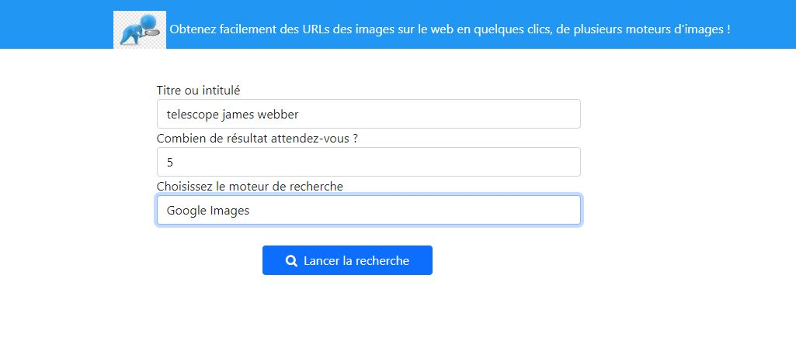
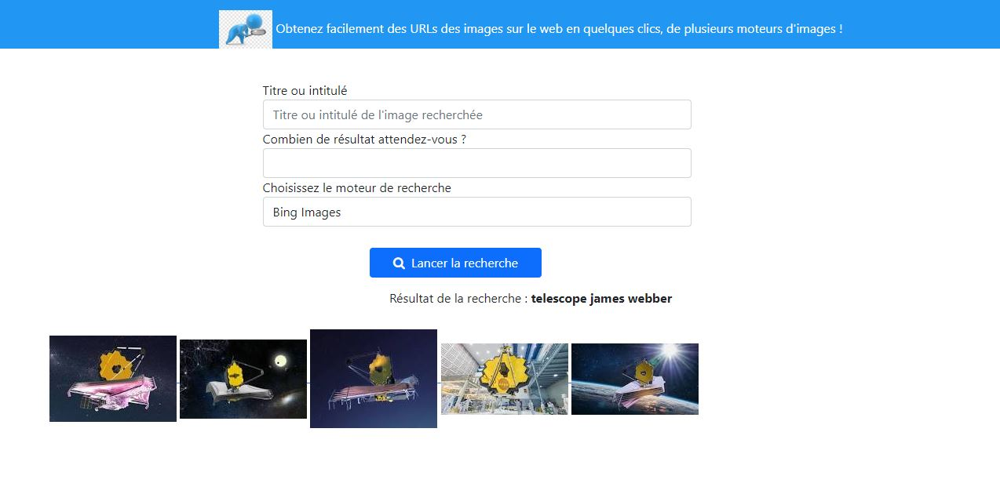

# EngineSearch

Class PHP to search image by Google and Bing motors.

## Installation

Download and insert this class in your project.

```bash
require 'engine.php';
```

## Usage

```python
require 'lib/engine.php';

# Required variables
$query = 'description of image searching' ;
$limit = 'nomber of results';
$searchengine = 'motor to use';

# Examples to use
$query = 'github logo' ;
$limit = '5';
$searchengine = 'google'; // bing

# Declaration
$imageBySearchEngine = new ImageBySearchEngine();
$tabImages = $imageBySearchEngine->search( $query, $limit, $searchengine );

# Array of results
'$tabImages' is an array contains '$limit' items of your research.

```
## Pictures




## Contributing
Thank you to [Joseph BIBANG](https://github.com/BIBANGJoseph1993), a Developer Full-Stack.